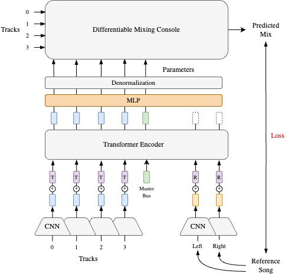

<div align="center">

# Diff-MST: Differentiable Mixing Style Transfer
[Paper](https://sai-soum.github.io/assets/pdf/Differentiable_Mixing_Style_Transfer.pdf) | [Website](https://sai-soum.github.io/projects/diffmst/) | [Video](https://youtu.be/w90RGZ3IqQw)




</div>

<!-- Mixing style transfer using reference mix. 
There are two mixing console configurations (in `modules.py`)
1. `BasicMixConsole`: Gain + Pan
2. `AdvancedMixConsole`: Gain + Pan + Diff EQ + Diff Compressor

Mixes for training can be created using either `naive_random_mix` (assigns random parameter values for mixing console to create a mix) or `knowledge_engineering_mix` (uses knowledge engineering to assign parameter values for mixing console to create a mix). Both of these modules can be found in `mixing.py`

 -->
# Repository Structure
1. `configs` - Contains configuration files for training and inference.
2. `mst` - Contains the main codebase for the project.
    - `dataloaders` - Contains dataloaders for the project.
    - `modules` - Contains the modules for different components of the system.
    - `mixing` - Contains the mixing modules for creating mixes.
    - `loss` - Contains the loss functions for the project.
    - `panns` - contains the most basic components like cnn14, resnet, etc.
    - `utils` - Contains utility functions for the project.
3. `scripts` - Contains scripts for running inference.  

# Setup
- Clone the repository
```
git clone https://github.com/sai-soum/Diff-MST.git
cd Diff-MST
```

- Create new Python environment
```
# for Linux/macOS
python3 -m venv env
source env/bin/activate
```

- Install the `mst` package from source
```
# Install as editable (for development)
pip install -e .

# Alternatively, do a regular install (read-only)
pip install .
```

# Usage
## Train
We use [LightningCLI](https://lightning.ai/docs/pytorch/stable/) for training and [Wandb](https://wandb.ai/site) for logging.

### Setup
In the `configs` directory, you will find the configuration files for the project.
- `config.yaml` - Contains the general configuration for the project.
- `optimizer.yaml` - Contains the optimizer configuration for the project.
- `data/` - Contains the data configuration for the project.
- `models/` - Contains the model configuration for the project.
We have provided instructions within the configuration files for setting up the project.

Few important configuration parameters:
- In `configs/data/` change the following
    - `track_root_dirs` - The root directory for the dataset needs to be setup. You can pass multiple dataset directories as a list. However, you will also need to provide corresponding metadata YAML files containing train, test, and val split. Check `data/` directory for examples.
    - For method 1: set `generate_mix` to `True` in the model configuration file. Use `medley+cambridge-8.yaml` for training with random mixes of the same song as reference.
    - For method 2: set `generate_mix` to `False` in the model configuration file. Use `medley+cambridge+jamendo-8.yaml` for training with real unpaired songs as reference.
    - update `mix_root_dirs` - The root directory for the mix dataset. This is used for training with real unpaired songs as reference. 
- You may benefit from setting a smaller value for `train_buffer_size_gb` and `val_buffer_size_gb` in the data configuration file for initial testing of the code.
- In `configs/models/`
    - you can change the audio effects you want to disable by setting a very large value for the corresponding parameter. For example, to disable the compressor, set `active_compressor_epoch` to `1000`.
    - You can change the loss function used for training by setting the `loss` parameter.
- In `optimizer.yaml` you can change the learning rate parameters.
- In `config.yaml` 
    - Update the directory for logging using `save_dir` under `trainer`.
    - You can use `ckpt_path` to load a pre-trained model for fine-tuning, resuming training, or testing.


### Method 1: Training with random mixes of the same song as reference using MRSTFT loss.
```
CUDA_VISIBLE_DEVICES=0 python main.py fit \
-c configs/config.yaml \
-c configs/optimizer.yaml \
-c configs/data/medley+cambridge-8.yaml \
-c configs/models/naive.yaml
```

To run the fine-tuning using AFLoss
```
CUDA_VISIBLE_DEVICES=0 python main.py fit \
-c configs/config.yaml \
-c configs/optimizer.yaml \
-c configs/data/medley+cambridge-8.yaml \
-c configs/models/naive+feat.yaml
```

You can change the number of tracks, the size of training data for an epoch, and the batch size in the data configuration file located at `configs/data/`

### Method 2: Training with real unpaired songs as reference using AFloss.

```
CUDA_VISIBLE_DEVICES=0 python main.py fit \
-c configs/config.yaml \
-c configs/optimizer.yaml \
-c configs/data/medley+cambridge+jamendo-8.yaml \
-c configs/models/unpaired+feat.yaml
```

## Inference
To evaluate the model on real world data, run the ` scripts/eval_all_combo.py` script. 

Update the model checkpoints and the inference examples directory in the script. 

`Python 3.10` was used for training. 


## Acknowledgements
This work is funded and supported by UK Research and Innovation [grant number EP/S022694/1] and Steinberg Media Technologies GmbH under the AI and Music Centre for Doctoral Training (AIM-CDT) at the Centre for Digital Music, Queen Mary University of London, London, UK. 

## Citation
If you find this work useful, please consider citing our paper:
```
@inproceedings{vanka2024diffmst,
  title={Diff-MST: Differentiable Mixing Style Transfer},
  author={Vanka, Soumya and Steinmetz, Christian and Rolland, Jean-Baptiste and Reiss, Joshua and Fazekas, Gy{\"o}rgy},
  booktitle={Proc. of the 25th Int. Society for Music Information Retrieval Conf. (ISMIR)},
  year={2024},
  organization={Int. Society for Music Information Retrieval (ISMIR)},
  abbr = {ISMIR},
  address = {San Francisco, USA},
}
```

## License
The code is licensed under the terms of the CC-BY-NC-SA 4.0 license. For a human-readable summary of the license, see https://creativecommons.org/licenses/by-nc-sa/4.0/deed.en .
