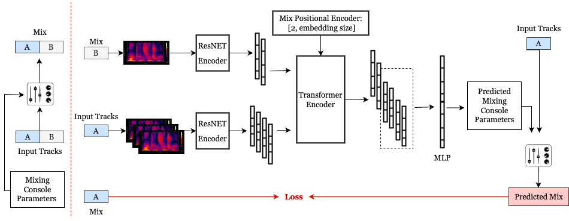

<div align="center">

# Differentiable Mixing Style Transfer
[Paper]() | [Website]()




</div>

Mixing style transfer using reference mix. 
There are two mixing console configurations (in `modules.py`)
1. `BasicMixConsole`: Gain + Pan
2. `AdvancedMixConsole`: Gain + Pan + Diff EQ + Diff Compressor

Mixes for training can be created using either `naive_random_mix` (assigns random parameter values for mixing console to create a mix) or `knowledge_engineering_mix` (uses knowledge engineering to assign parameter values for mixing console to create a mix). Both of these modules can be found in `mixing.py`


# Usage

Clone the repository and install the `mst` package.
```
git clone https://github.com/sai-soum/mix_style_transfer.git
cd mix_style_transfer
python -m venv env
source env/bin/activate
pip install -e .
```

[dasp-pytorch](https://github.com/csteinmetz1/dasp-pytorch) is required for differentiable audio effects.
Clone the repo into the top-level of the project directory.
```
git clone https://github.com/csteinmetz1/dasp-pytorch.git
cd dasp-pytorch
pip install -e .
```

Since `dasp` is currently under development you need to pull changes periodically. 
To do so change to the directory and pull.
```
cd dasp-pytorch
git pull
```

## Inference

```
CUDA_VISIBLE_DEVICES=5 python scripts/run.py \
checkpoints/20230719/config.yaml \
checkpoints/20230719/epoch=132-step=83125.ckpt \
"/import/c4dm-02/acw639/DiffMST/song 2/Kat Wright_By My Side/" \
output/ref_mix.wav \
```

## Train

First update the paths in the configuration file for both the logger and the dataset root directory.
Then call the `main.py` script passing in the configuration file. 
```
# new model configuration with audio feature loss
CUDA_VISIBLE_DEVICES=3 python main.py fit \
-c configs/config.yaml \
-c configs/optimizer.yaml \
-c configs/data/medley+cambridge+jamendo-4.yaml \
-c configs/models/gain+eq+comp-feat.yaml

# new model configuration with CLAP loss
CUDA_VISIBLE_DEVICES=0 python main.py fit \
-c configs/config_cjs.yaml \
-c configs/optimizer.yaml \
-c configs/data/medley+cambridge+jamendo-8.yaml \
-c configs/models/gain+eq+comp-clap.yaml
```


# Stability (ignore)
```
source env/bin/activate
cd /scratch
mkdir medleydb
cd medleydb
aws s3 sync s3://stability-aws/MedleyDB ./
tar -xvf MedleyDB_v1.tar
tar -xvf MedleyDB_v2.tar
python main.py fit -c configs/config.yaml -c configs/optimizer.yaml -c configs/data/medleydb_cjs.yaml -c configs/models/naive_dmc_adv.yaml
CUDA_VISIBLE_DEVICES=7 python main.py fit -c configs/config_cjs.yaml -c configs/optimizer.yaml -c configs/data/medleydb_c4dm.yaml -c configs/models/ke_dmc_adv.yaml

CUDA_VISIBLE_DEVICES=3 python main.py fit -c configs/config.yaml -c configs/optimizer.yaml -c configs/data/medley+cambridge-4.yaml -c configs/models/mstft+stereolosses.yaml

To run the paramloss code

CUDA_VISIBLE_DEVICES=3 python main.py validate -c configs/config.yaml -c configs/optimizer.yaml -c configs/data/medley+cambridge-4.yaml -c configs/models/gain+eq+comp-feat.yaml
```

