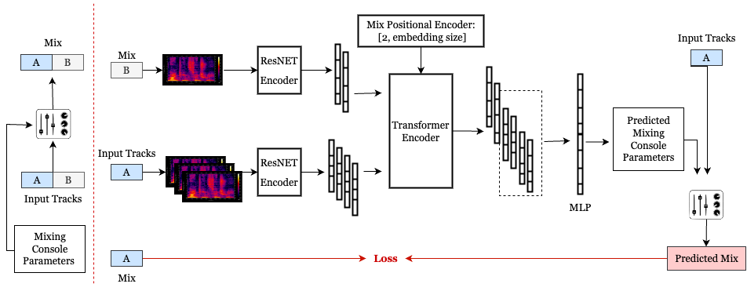

# Diff-MST
<div align="center">

# Differentiable Mix Style Transfer



</div>

Mixing style transfer using reference mix. 
Given the stems of a song and the correcsponding demo mix, the model can predict gain and pan parameters for each of the stems.


# Usage

Clone the repository and install the `mst` package.
```
git clone https://github.com/sai-soum/mix_style_transfer.git
cd mix_style_transfer
python -m venv env
source env/bin/activate
pip install -e .
```

[dasp-pytorch](https://github.com/csteinmetz1/dasp-pytorch) is required for differentiable audio effects.
Clone the repo into the top-level of the project directory.
```
git clone https://github.com/csteinmetz1/dasp-pytorch.git
cd dasp-pytorch
pip install -e .
```

Since `dasp` is currently under development you need to pull changes periodically. 
To do so change to the directory and pull.
```
cd dasp-pytorch
git pull
```

## Train

To train the model: 
```
python scripts/train.py fit --config=configs/medleydb_resnet.yaml
```